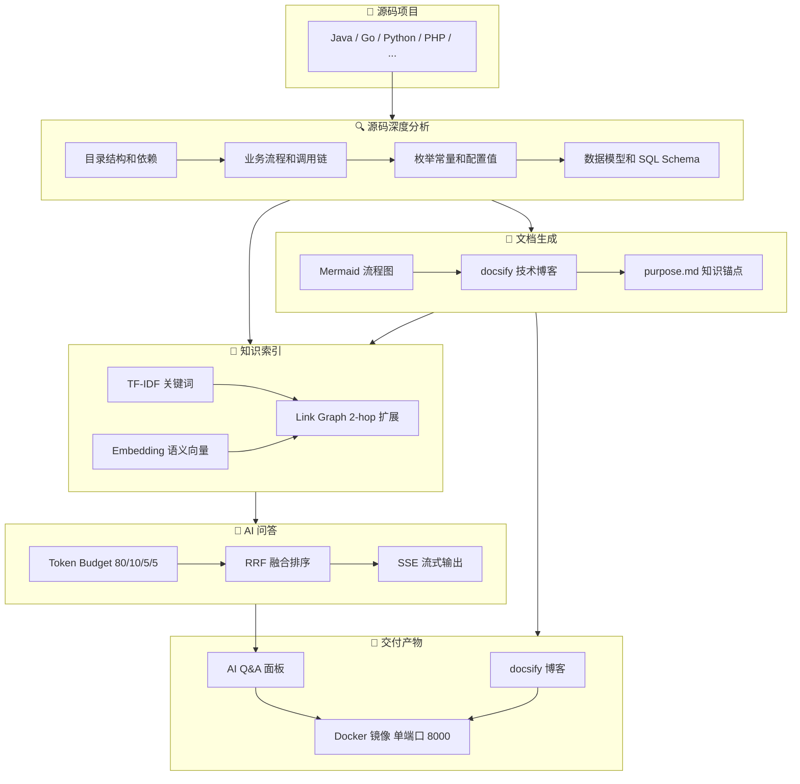
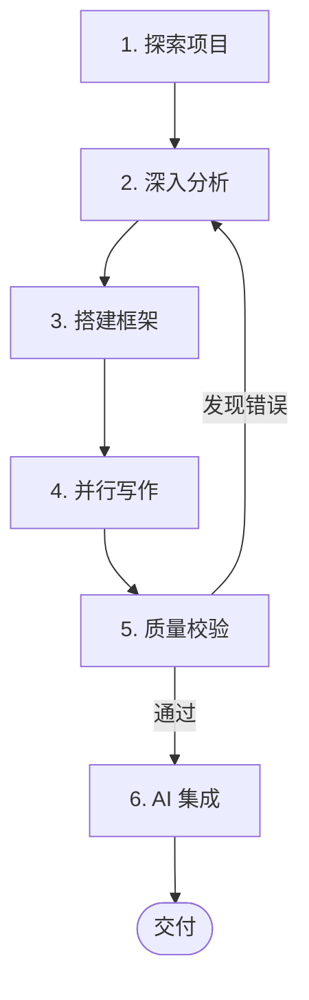

# project-docsify

**代码是最精准的业务描述语言。**

将任意编程语言项目的源码深度分析成果，转化为结构化、图文并茂的 [docsify](https://docsify.js.org/) 技术博客，并内置 **AI 问答能力**——用户可在文档页面直接提问，AI 基于文档内容给出精准回答。

## 架构全景



## 设计理念

> **源码为准，图先文后，分门别类，庖丁解牛**

传统技术文档最大的问题是**幻觉**——猜测枚举值、编造流程、臆测配置。project-docsify 的核心信条是：**一切从源码中读取，不做任何猜测**。

| 痛点         | 我们的解法                                           |
| ------------ | ---------------------------------------------------- |
| 枚举值靠猜   | 逐行读源码中的常量定义，记录精确值与含义             |
| 表结构靠想   | 读 SQL DDL / Table 类 / Model 类，列名类型一一对齐   |
| 配置值靠编   | 从配置文件和代码中读取 TTL、线程数、超时时间等实际值 |
| 流程图靠画   | 跟踪方法调用链，还原真实执行路径                     |
| 文档无人维护 | AI Q&A 基于文档内容实时回答，文档即知识库            |

## 创新点

### 1. 文档 + AI 问答一体化

不只是静态文档——内置 AI 问答系统，让文档**可交互**。用户在 docsify 页面右下角直接提问，AI 基于文档内容精准回答，引用来源可点击跳转。

### 2. 混合检索 + 图扩展

TF-IDF 关键词 + Embedding 语义向量双重检索，RRF 融合排序。更有 **Link Graph 2-hop 扩展**——当你问"权限变更流程"时，不仅找到权限管理章节，还会通过引用关系自动关联邀请机制、策略缓存等章节。

### 3. Token Budget 上下文分配

参考 [llm_wiki](https://github.com/nicepkg/llm-wiki) 策略，按比例分配 token 预算：80% 文档内容 / 10% 对话历史 / 5% 知识索引 / 5% 系统提示，确保 LLM 回答质量。

### 4. 图文结合的回答质量

AI 回答不只是文字——涉及流程时自动生成 mermaid flowchart，涉及交互时生成 sequenceDiagram，涉及状态转换时生成 stateDiagram-v2。先图后文，一目了然。

### 5. 反幻觉机制

- **purpose.md** 锚定知识库边界，防止 AI 越界
- **System Prompt** 约束"只根据文档内容回答，标注 [未验证]"
- **源码校验** 阶段 5 逐项核对枚举值、表结构、流程图与源码一致性

## 安装

### 方式一：Git Clone

```bash
git clone git@github.com:lymboy/project-docsify.git ~/.claude/skills/project-docsify
```

### 方式二：对话式安装

在 Claude Code 对话中直接说：

> 帮我安装 skill：git clone git@github.com:lymboy/project-docsify.git 到 ~/.claude/skills/project-docsify

Claude 会自动执行 clone 并完成安装。

## 推荐搭配

架构图生成依赖画图 skill，建议一并安装（任选其一即可）：

### baoyu-diagram

暗色主题 SVG，支持架构图/流程图/时序图/状态机等 9 种类型

```bash
git clone https://github.com/JimLiu/baoyu-skills/  ~/.claude/plugins/cache/baoyu-skills
```

### fireworks-tech-graph

技术图生成，SVG + PNG 导出

```bash
git clone https://github.com/yizhiyanhua-ai/fireworks-tech-graph.git ~/.claude/skills/fireworks-tech-graph
```

> 需安装 `rsvg-convert` 用于 PNG 导出：macOS `brew install librsvg`，Ubuntu `sudo apt install librsvg2-bin`

安装后，project-docsify 会在第一章概览中自动调用画图 skill 生成业务架构 SVG。

## 使用

安装后，在 Claude Code 对话中提及文档生成即可触发：

```
分析 /path/to/project 源码，生成文档到 /path/to/output
```

## 适用语言

Java / Spring Boot / Go / Python / PHP / Node.js / 任何有源码的项目

## 工作流程



| 阶段           | 目标                  | 关键动作                                        |
| -------------- | --------------------- | ----------------------------------------------- |
| 1. 探索项目    | 建立全景认知          | 目录结构、依赖分析、配置文件、数据库 Schema     |
| 2. 深入分析    | 阅读源码记录精确信息  | 业务流程、枚举常量、数据模型、技术组件          |
| 3. 搭建框架    | 创建 docsify 博客骨架 | 复制模板文件、替换项目名、配置 Prism 语言       |
| 4. 并行写作    | 多 Agent 并行编写     | 图先文后、Mermaid 图表、章节 README 概览        |
| 5. 质量校验    | 零幻觉                | 枚举值 vs 源码、表结构 vs DDL、流程 vs 调用链   |
| 6. AI 问答集成 | 文档 + Q&A 一体化     | 构建 TF-IDF 索引、创建 purpose.md、验证服务启动 |

## AI 问答架构

| 组件                   | 说明                                             |
| ---------------------- | ------------------------------------------------ |
| **混合检索**     | TF-IDF 关键词 + Embedding 语义向量，RRF 融合排序 |
| **Link Graph**   | 文档间引用关系图谱，2-hop 扩展补充关联章节       |
| **Token Budget** | 80% 文档 / 10% 历史 / 5% 索引 / 5% 系统          |
| **purpose.md**   | 知识库目标与范围锚点，防止 AI 越界               |
| **流式输出**     | SSE 推送 token，支持 mermaid 图表实时渲染        |
| **引用跳转**     | `[来源: xx.md]` 点击直接跳转到对应文章         |

### 用户需配置的环境变量

推荐使用金山云星流服务：https://docs.ksyun.com/documents/44740?type=3

| 变量                 | 必填 | 说明                                       | 示例                        |
| -------------------- | ---- | ------------------------------------------ | --------------------------- |
| `LLM_API_KEY`        | 否   | LLM API 密钥                               | https://kspmas.ksyun.com/v1 |
| `LLM_API_BASE`       | 否   | LLM API 地址（默认 OpenAI 兼容）           | xxxxxx                      |
| `LLM_MODEL`          | 否   | 模型名称                                   | glm-5.1                     |
| `EMBEDDING_API_BASE` | 否   | Embedding API 地址（开启语义检索时需配置） | http://kspmas.ksyun.com     |
| `EMBEDDING_API_KEY`  | 否   | Embedding API 密钥                         | xxxxxx                      |
| `EMBEDDING_MODEL`    | 否   | Embedding 模型名称                         | qwen3-embedding-8b          |

## 目录结构

```
project-docsify/
├── SKILL.md          # Skill 定义文件（agent 识别入口）
├── index.html        # docsify 入口模板（含 {{PROJECT_NAME}} 占位符）
├── Dockerfile        # python:3.11-slim 统一服务模板（FastAPI + docsify + Q&A）
├── .dockerignore     # 排除 .git/DOCKER.md/__pycache__/.claude/
├── server/           # AI 问答后端
│   ├── main.py       # FastAPI 统一服务：docsify + API + widget 注入
│   ├── config.py     # 配置中心，所有参数从环境变量读取
│   ├── indexer.py    # 文档索引：TF-IDF + Embedding + Link Graph
│   ├── qa_engine.py  # 问答引擎：Token Budget + RRF + 2-hop 图扩展
│   └── requirements.txt
└── docqa-widget/     # 聊天组件
    ├── widget.css    # 浮动面板样式（亮色主题，scoped）
    └── widget.js     # SSE 流式 + mermaid 渲染 + 引用跳转 + 可拖拽
```

## 部署

```bash
# 本地预览（docsify + AI Q&A）
PYTHONPATH=. python -m server
# 访问 http://localhost:8000

# 仅预览 docsify（无 Q&A）
npx docsify-cli serve docs

# 构建 Docker 镜像
docker build --platform linux/amd64 -t project-doc:1.0 .

# 运行
docker run -p 8000:8000 -e LLM_API_KEY=your-key project-doc:1.0

# 重建搜索索引
curl -X POST http://localhost:8000/api/rebuild
```

## 实践案例

| 项目                                       | 语言 | 章节/篇数   | 特点                 |
| ------------------------------------------ | ---- | ----------- | -------------------- |
| [SkyWalking APM](https://lymboy.com/sky-doc/) | Java | 9 章 30+ 篇 | Mermaid 图表 + ER 图 |
