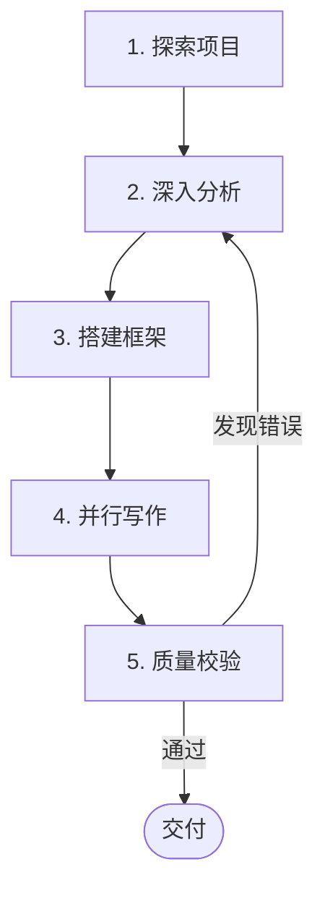

# Project Docsify

## Overview

将任意编程语言项目的源码深度分析成果，转化为结构化、图文并茂的 docsify 技术博客。核心原则：**源码为准，图先文后，分门别类，庖丁解牛，业务驱动**。

**技术服务于业务**：永远不脱离业务谈技术。每个技术组件必须回答"它解决了什么业务问题"，每个业务流程必须说清"它依赖哪些技术实现"。

## When to Use

- 用户要求分析一个项目的源码并输出技术文档
- 用户要求将项目分析结果整理为可部署的 docsify 博客
- 用户要求生成含 Mermaid 图表的项目架构文档
- 用户提到 "博客化"、"文档化"、"docsify" 等关键词
- 用户需要将数据库表结构、业务流程、技术架构等内容输出为可阅读的技术文档

## Core Pattern

整个流程分为 5 个阶段，严格遵守执行顺序：



### 阶段 1：探索项目

**目标**：建立项目全景认知，不遗漏任何模块。

1. **目录结构**：用 Explore Agent 获取完整目录树、包/模块结构、文件数量
2. **依赖分析**：读取依赖配置文件（pom.xml / build.gradle / go.mod / requirements.txt / package.json / composer.json 等），提取所有依赖及版本
3. **配置文件**：读取项目配置（application.yml / .env / config.yaml / settings.py / config.json 等），理解环境与外部服务
4. **数据库 Schema**：读取最新 SQL 文件，提取所有表定义
5. **已有文档**：检查 README.md、CLAUDE.md 等已有知识文件

### 阶段 2：深入分析

**目标**：对每个业务模块和技术组件，阅读实际源码，记录精确信息。

**必须遵守的规则**：
- **读源码，不猜测**：枚举值、常量、方法名、参数值必须从源码中读取
- **读 SQL，不编造**：表名、列名、列类型必须与 SQL DDL 一致
- **读配置，不臆测**：TTL、线程池大小、超时时间等数值必须从配置/代码中确认
- **业务驱动，不浮于表面**：每个技术组件必须回答"解决了什么业务问题"，每个业务流程必须说清上下游依赖

按以下维度启动并行 Explore/General Agent：

| 分析维度 | 关注点 | 深度要求 |
|----------|--------|----------|
| **业务全景** | 项目在业务生态中的定位、上下游系统、数据流向 | **必须**拆解出当前项目涉及的所有上下游模块，画清边界 |
| **业务流程** | 每个核心业务场景的完整生命周期 | **必须**从业务触发 -> 数据流转 -> 结果输出全链路跟踪，不能只写 Controller->Service->DAO |
| 枚举常量 | 每个枚举/常量的精确值和中文描述 | 从源码读取实际值 |
| 数据模型 | 表结构、列类型、外键关系 | 从 SQL DDL 或 ORM Model 确认 |
| 定时任务 | 定时调度 handler 列表、触发逻辑、批处理模式 | 说明业务目的，不只是罗列 |
| 技术组件 | 缓存用法、事件驱动、中间件策略、外部调用模式 | 必须关联到具体业务场景 |
| 核心计算 | 精确公式、业务含义、核心原则 | 必须解释业务规则，不能只写代码逻辑 |

**业务流程深度分析要求**：

1. **上下游拆解**：识别当前项目的所有上游（数据来源）和下游（数据消费方），明确每个交互的协议（HTTP/MQ/RPC/DB）、数据格式、触发条件
2. **业务场景还原**：对每个核心业务场景，还原完整的业务故事线：谁触发、经过哪些环节、产出什么结果、失败了怎么办
3. **跨模块数据流**：追踪一条数据从进入系统到最终产出的完整路径，标注每个环节的数据转换和持久化
4. **业务规则提炼**：从代码中提炼出业务规则（而非代码逻辑），用业务语言描述"为什么这样设计"

### 阶段 3：搭建框架

**目标**：创建 docsify 博客骨架。

**模板文件**：本 skill 目录已提供 `index.html`、`Dockerfile`、`.dockerignore`、`server/`、`docqa-widget/` 模板，直接复制到输出目录，仅替换占位符即可，无需重新生成。

| 模板文件 | 占位符 | 操作 |
|---------|--------|------|
| `index.html` | `{{PROJECT_NAME}}` | 替换为项目名称 |
| | `{{SEO_DESCRIPTION}}` | 替换为项目一句话描述，用于搜索引擎和社交分享 |
| | `{{SEO_KEYWORDS}}` | 替换为项目关键词逗号分隔，如 `微服务,API,架构` |
| | `{{SEO_AUTHOR}}` | 替换为作者或团队名 |
| | Prism.js 语言行 | 按需取消注释 |
| `Dockerfile` | 无 | 直接复制（Python 统一服务） |
| `.dockerignore` | 无 | 直接复制 |
| `server/*` | 无 | 直接复制（AI 问答后端） |
| `docqa-widget/*` | 无 | 直接复制（聊天组件） |

目录结构：
```
{output-dir}/
├── docs/
│   ├── index.html          # 从模板复制，替换项目名 + Prism 语言
│   ├── README.md           # 首页
│   ├── _sidebar.md         # 侧边栏导航
│   ├── assets/
│   │   ├── logo.svg
│   │   └── images/
│   ├── 01-overview/        # 第一章：项目概览
│   ├── 02-xxx/             # 第二章：按业务域
│   ├── ...                 # 按需扩展
│   └── N-architecture/     # 技术架构章节
├── Dockerfile              # 从模板直接复制（Python 统一服务）
├── .dockerignore           # 从模板直接复制
├── server/                 # AI 问答后端（从模板直接复制）
│   ├── config.py
│   ├── main.py
│   ├── indexer.py
│   ├── qa_engine.py
│   └── requirements.txt
├── docqa-widget/           # 聊天组件（从模板直接复制）
│   ├── widget.css
│   └── widget.js
├── index/                  # 搜索索引缓存（自动生成）           # 从模板直接复制
└── DOCKER.md               # 部署说明（需生成）
```

**_sidebar.md 规范**：
- 一级标题用 `**粗体**` 作为分组（不可点击）
- 二级标题为文章链接，使用中文文件名 + 数字前缀排序
- `subMaxLevel: 4` 自动展开子标题

### 阶段 4：并行写作

**目标**：多 Agent 并行编写各章节内容。

**写作原则**：
1. **图先文后**：每个概念先用图呈现，再辅以文字说明
2. **由浅入深**：章节 README 为概览，子文档为深度展开
3. **业务驱动**：技术描述必须绑定业务场景，禁止出现脱离业务的纯技术罗列
4. **图类型选择**：
   - 业务流程 -> `flowchart TB/LR`
   - 交互时序 -> `sequenceDiagram`
   - 状态转换 -> `stateDiagram-v2`
   - 数据关系 -> `erDiagram`
   - 类设计 -> `classDiagram`
5. **mermaid 安全规则**：
   - 节点 ID 使用纯 ASCII（A, B, node1）
   - 中文文本放在标签中：`A[中文标签]`
   - 数据库列使用实际类型（如 int），不臆测类型
   - subgraph 名称可中文
   - **换行规则**：flowchart/stateDiagram 用 `\n`；sequenceDiagram 用 `<br/>`（`\n` 在 sequenceDiagram 中不换行）

**章节组织模板**：

每个章节目录包含：
- `README.md`：着陆页，含章节概览图和目录表
- `01-主题名.md`~`N-主题名.md`：深度文档

每篇文章结构：
```markdown
# 标题

简短引入（1-2 句）

---

## 概览图

\```mermaid
flowchart/sequence/stateDiagram
\```

## 详细说明

分步骤解释图中每个环节

## 关键数据

| 项目 | 值 | 说明 |
|------|-----|------|
```

**并行策略**：
- 按"章"分配 Agent，每 Agent 负责一个完整章节
- 第一章（概览）先写，为后续章节建立术语和风格基准
- 数据库章节最后写，确保表结构描述与其他章节引用一致

**项目概览章节必须包含架构图**：

第一章的项目概览/整体架构文章必须包含一张**业务架构图**，要求：
- 图中体现**业务功能模块**（如"计收管理"、"账单导出"、"合同管理"），**严禁出现 XxxService/XxxController 等代码类名**
- 图中体现**上下游系统**（上游数据来源、下游消费方）
- 图中体现**核心中间件**（MQ、缓存、数据库、搜索引擎等）
- 图中标注**业务数据流向**（实线箭头）和**系统边界**（虚线框）

**架构图生成策略**（按优先级自动降级）：

1. **检测画图 skill**：检查 `baoyu-diagram` 或 `fireworks-tech-graph` 是否可用（尝试调用 Skill 工具，若报 skill 不存在则不可用）
2. **可用** → 调用画图 skill 生成 SVG 架构图，保存到 `docs/assets/images/architecture.svg`，文章中用相对路径 `` 引用
3. **不可用** → 降级使用 mermaid `flowchart TB` 绘制架构图（内嵌在 .md 中），同时**提示用户**：

   > 当前未安装画图 skill，架构图已降级为 mermaid 内嵌图。安装 `baoyu-diagram` 或 `fireworks-tech-graph` 可生成更精美的独立 SVG 架构图，详见 README "推荐搭配" 章节。

4. **docsify 配置**：无论哪种方式，`index.html` 中 docsify 配置需加 `relativePath: true`，确保图片相对路径正确解析

**SVG 架构图设计原则**（使用画图 skill 生成 SVG 时遵循）：

- **布局即语义**：用空间位置表达关系，减少箭头依赖。左→右 = 数据流方向，上→下 = 依赖层级
- **箭头必须有价值**：每个箭头必须传达布局无法表达的信息（如：哪条是主业务链路、跨层依赖、异步方向）。布局已隐含的关系不加箭头
- **箭头区分语义**：实线 = 同步主业务流，虚线橙色 = 异步事件，虚线紫色 = 配置/基础设施流
- **箭头绘制顺序**：先画箭头层（z-order 在底层），再画组件框（遮盖箭头穿过的部分），避免视觉杂乱
- **箭头透明度**：主业务流 `opacity="0.5"`，异步/配置流 `opacity="0.3~0.35"`，让箭头层次分明

### 阶段 5：质量校验

**目标**：确保文档与源码 100% 一致，零幻觉。

**校验清单**：

| 校验项 | 方法 |
|--------|------|
| 枚举值准确性 | 文档中的每个枚举值 vs 源码常量文件 |
| 表结构准确性 | 文档中的列名/类型 vs SQL DDL |
| 公式准确性 | 文档中的计算公式 vs 源码核心方法 |
| 流程准确性 | 文档中的流程描述 vs 源码实际调用链 |
| mermaid 语法 | 所有图块正确闭合、ID 无中文、箭头语法正确 |
| 代码块配对 | 每个 \`\`\` 开头有对应的 \`\`\` 闭合 |
| 交叉引用 | 侧边栏链接与实际文件路径一致 |

**关键铁律**：
- `NO GUESSING` -- 任何数值、名称、流程如果无法从源码确认，标注"待确认"而非猜测
- `READ FIRST, WRITE SECOND` -- 先读源码再写文档，绝不允许凭记忆编写
- `VERIFY EVERYTHING` -- 写完后逐项回源码验证

### 阶段 6：AI 问答集成（Doc-QA）

**目标**：将文档与 AI 问答系统集成，用户可在 docsify 页面直接提问。

**自动执行**：
1. 从 skill 目录复制 `server/` 和 `docqa-widget/` 到项目根目录
2. 从 skill 目录复制 `Dockerfile` 和 `.dockerignore`（已替换为 Python 版本，不含 nginx）
3. 创建 `docs/purpose.md` — 知识库目标与范围文件，内容从项目分析结果提炼
4. 删除 `nginx.conf`（不再需要）
5. 构建搜索索引：`cd {project} && PYTHONPATH=. python -c "from server.indexer import build_index; build_index('docs', 'index')"`
6. 验证服务启动：`PYTHONPATH=. python -m server` → 确认 `http://localhost:8000` 可访问

**用户需要配置**：
- `LLM_API_KEY` — LLM API 密钥（必填）
- `EMBEDDING_API_BASE` + `EMBEDDING_API_KEY` + `EMBEDDING_MODEL` — Embedding API（可选，开启语义检索）

**模板文件**（从 skill 目录复制，无需修改）：

| 文件 | 说明 |
|------|------|
| `server/config.py` | 配置中心，所有参数从环境变量读取 |
| `server/main.py` | 统一 FastAPI 服务：docsify + API + widget 注入 |
| `server/indexer.py` | 文档索引：TF-IDF + Embedding + Link Graph |
| `server/qa_engine.py` | 问答引擎：Token Budget + RRF + 2-hop 图扩展 |
| `server/requirements.txt` | Python 依赖 |
| `docqa-widget/widget.css` | 聊天组件样式（亮色主题，scoped） |
| `docqa-widget/widget.js` | 聊天组件逻辑（SSE 流式 + mermaid + 可拖拽） |

**docs/purpose.md 模板**：
```markdown
# 知识库目标与范围

## 定位
本知识库是对 {{PROJECT_NAME}} 源码的深度分析成果。所有知识从 {{PROJECT_LANGUAGE}} 源码推导而来，不是泛泛的 Wiki 或猜测。

## 核心业务域
{{从阶段2分析结果中提炼3-7个业务域，按数据流向排列}}

## 关键技术特征
{{从阶段2分析结果中提炼3-5个核心技术点}}

## 知识边界
- 只覆盖本系统内部逻辑，不涉及上下游系统内部实现
- 枚举值、状态码、字段名等精确细节是本知识库的核心价值
- 架构决策均有业务背景解释（WHY），不只是技术描述
```

## Quick Reference

| 操作 | 命令/方法 |
|------|-----------|
| 预览博客+AI问答 | `PYTHONPATH=. python -m server` → http://localhost:8000 |
| 仅预览 docsify | `npx docsify-cli serve docs` |
| 构建 Docker 镜像 | `docker build -t {name}:1.0 .` |
| 推送镜像(amd64) | `docker build --platform linux/amd64 -t {registry}/{name}:1.0 . && docker push` |
| 创建 Git Tag | `git tag -a 1.0 -m "v1.0: 初始版本"` |
| 重建搜索索引 | `curl -X POST http://localhost:8000/api/rebuild` |
| 校验 mermaid | 逐个读取 .md 文件，检查语法正确性 |

## Common Mistakes

| 错误 | 后果 | 正确做法 |
|------|------|----------|
| 凭记忆写枚举/常量值 | 文档误导读者 | 从源码常量/枚举定义处读取实际值 |
| 编造不存在的表 | ER 图与实际不符 | 从 SQL DDL / migration 文件逐表确认 |
| 列类型写错（如 int 写成 varchar） | 技术文档丧失可信度 | 从 SQL CREATE TABLE / ORM Model 定义复制精确类型 |
| mermaid 节点 ID 用中文 | 图表渲染失败 | 中文只放标签 `A[中文]` |
| subgraph 标签用双引号 `subgraph G["xxx"]` | 浏览器端 mermaid 10.x 渲染失败（GitHub 服务端可渲染） | 用无引号语法 `subgraph G[xxx]`，不要在 subgraph 标签中放 emoji |
| subgraph 标签中放 emoji | 浏览器端渲染失败或乱码 | emoji 移到内部节点标签中 |
| style 对 subgraph 着色 | 部分浏览器/版本不生效或报错 | 避免对 subgraph 使用 style，保持默认样式 |
| sequenceDiagram 中用 `\n` 换行 | 渲染不换行，文字挤在一起 | sequenceDiagram 中用 `<br/>` 换行；flowchart/stateDiagram 中 `\n` 可正常工作 |
| stateDiagram 用 `state X { note: ... }` 加注释 | 渲染报错，复合状态语法不能放 note | 用 `state "X\n中文描述" as X` 将描述写进标签，或用 `note right of X` 语法 |
| 配置数值猜测（TTL/超时/线程数等） | 与源码不一致 | 从源码配置文件或代码读取实际值 |
| 流程描述与源码调用链不符 | 读者按文档实现会失败 | 逐方法/函数跟踪实际调用链 |
| 只写技术不谈业务 | 文档像 API 文档，缺乏业务理解 | 每个技术组件必须回答"解决什么业务问题" |
| 架构图出现代码类名 | 读者无法从业务视角理解系统 | 架构图只用业务模块名，如"计收管理"而非"BillSummaryIncomeService" |
| SVG 架构图属性间缺空格 | 浏览器直接报 XML 解析错误，图片无法展示 | SVG 中相邻属性之间必须有空格，如 `stroke="#a78bfa" stroke-width="1.5"`，而非 `stroke="#a78bfa"stroke-width="1.5"`；图片不显示时先检查 SVG 本身是否有 XML 语法错误，再排查路径 |
| SVG 架构图箭头过多 | 图面杂乱，主次不分，读者无法抓住核心数据流 | 每个箭头必须传达布局无法表达的信息；布局已隐含的关系不加箭头；区分语义：实线=主业务流、虚线橙色=异步、虚线紫色=配置 |

## Docker 部署模板

阶段 3 搭建框架时，直接从本 skill 目录复制模板文件，无需重新生成：

| 模板文件 | 用途 | 复制命令 |
|---------|------|---------|
| `Dockerfile` | Python 统一服务（FastAPI + docsify + Q&A） | `cp {skill-dir}/Dockerfile {output-dir}/` |
| `.dockerignore` | 排除 .git/DOCKER.md/__pycache__ | `cp {skill-dir}/.dockerignore {output-dir}/` |
| `index.html` | docsify 入口 + mermaid + 插件 | `cp {skill-dir}/index.html {output-dir}/docs/` |
| `server/*` | AI 问答后端（FastAPI + 索引 + 问答引擎） | `cp -r {skill-dir}/server/ {output-dir}/server/` |
| `docqa-widget/*` | 聊天组件（CSS + JS） | `cp -r {skill-dir}/docqa-widget/ {output-dir}/docqa-widget/` |

如需定制（如不同端口、API Key、模型名），在复制后修改即可。

## Integration

- **前置**：用户需提供项目源码路径和输出目录路径
- **可选**：用户提供参考博客项目路径（复用 docsify 配置风格）
- **推荐搭配**：安装 `baoyu-diagram` 或 `fireworks-tech-graph` 画图 skill，用于生成业务架构 SVG 图（详见 README "推荐搭配" 章节）
- **输出**：完整的 docsify 博客目录 + Docker 部署配置 + Git 仓库